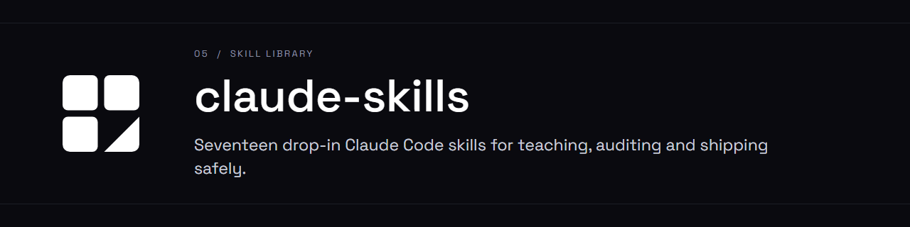

<div align="center">



**17 drop-in skills for [Claude Code](https://claude.com/claude-code): learning, workflow audits, and engineering discipline.**


</div>

My full `~/.claude/skills/` directory, made public so you can take whatever's useful.
Looking for the whole setup (commands, subagents, terminal layer)? See
[claude-code-kit](https://github.com/Nightdreams-bat/claude-code-kit). Machine-specific paths have been genericized; nothing here contains
secrets or personal data.

Pick and choose — each folder in `skills/` is self-contained. Copy the ones you want.

## Install

**A folder or two, by hand**

Copy `skills/<name>/` into your Claude Code skills directory:
- macOS/Linux: `~/.claude/skills/`
- Windows: `%USERPROFILE%\.claude\skills\`

Restart Claude Code.

**Everything, via script**

```bash
git clone https://github.com/Nightdreams-bat/claude-skills
cd claude-skills
./install.sh                    # macOS/Linux
powershell -File install.ps1     # Windows
```

The script skips any skill you already have unless you pass `--force`.

## What's in here

### Learning & knowledge (mine)

| Skill | Trigger | What it does |
|---|---|---|
| `teach` | auto — any time you're being taught/explained something | Multi-session teaching that locks in understanding: find the edge of what you know, build a dependency map of unconditional truths, teach node by node with graded questions. Writes lessons into an Obsidian vault. |
| `tutor` | `/tutor`, "quiz me", "test me" | Interactive quiz tutor over an Obsidian `StudyVault`: diagnostics, spaced drills of weak areas, progress dashboard. |
| `tutor-setup` | `/tutor-setup` | Turns source material (PDFs, docs, or a codebase) into a `StudyVault` of study notes + practice questions. |
| `visualize` | auto — when an idea is genuinely clearer as a picture | Adds ONE correct, minimal diagram/geometry figure to a lesson, rendered inline in Obsidian. |
| `diagram-maker` | auto / `/diagram-maker` | Builds SVG/HTML or Excalidraw diagrams for concepts, architecture, flows, whiteboards. |
| `youtube-transcript` | auto — a YouTube URL, "what does this video say" | Fetches a video's title, metadata, and full transcript as text/JSON. |

### Workflow & maintenance (mine)

| Skill | Trigger | What it does |
|---|---|---|
| `analyze-sessions` | "how much have I spent", "what do I use Claude for", "show me yesterday's session" | Token/cost rollups, most-used tools, prompt-pattern mining, and re-rendering an old local session to readable text. |
| `claude-checkup` | `/claude-checkup`, "audit my Claude config" | Three-phase, approval-gated audit → plan → repair of your `~/.claude` setup (CLAUDE.md/memory bloat, unused MCP, broken hooks, risky settings) plus a credit rollup. Tier-graded scorecard. |
| `scan-before-publish` | auto — about to push / open-source / hand off a build | Runs `ggshield` over the repo (working tree + history) and reports leaked secrets with file + line. |
| `web-debug` | web/frontend debugging via Chrome | Drives the Claude-in-Chrome tools to inspect console, network, and DOM while debugging a page. |

### Engineering discipline (from [`mattpocock/skills`](https://github.com/mattpocock/skills), MIT — unmodified)

| Skill | Trigger | What it does |
|---|---|---|
| `grilling` | auto — when you want to stress-test an idea | Interrogates you round by round until a vague request is a complete spec. Each question comes with a recommended answer. |
| `grill-me` | `/grill-me` | Thin wrapper that starts `grilling`. |
| `prototype` | auto — "does this feel right?" / "what should this look like?" | Builds **throwaway** code to answer one design question: a clickable HTML state-machine walkthrough, or several UI variations on one route. |
| `diagnosing-bugs` | auto — "debug this", something broken/slow | A disciplined diagnosis loop for hard bugs. Skip phases only with justification. |
| `resolving-merge-conflicts` | auto — during a git merge/rebase | Works conflicts hunk by hunk, preserves both intents, runs the project's checks, finishes the merge. |
| `improve-codebase-architecture` | `/improve-codebase-architecture` | Scans for shallow modules, presents deepening opportunities as an HTML report, then grills the one you pick. |
| `writing-for-agents` | auto — editing skills / `CLAUDE.md` / `AGENTS.md` | Reference for writing anything an agent reads. |

## Notes

- The learning skills (`teach`, `tutor`, `visualize`, ...) assume an **Obsidian vault** named `StudyVault`.
  They create it if missing; `<your vault root>` in the docs is wherever you keep it.
- Some scripts need `yt-dlp`, `pdftotext` (poppler), or `ggshield` on `PATH`.
- `claude-checkup` and `analyze-sessions` read your local Claude Code session logs — they never send anything anywhere.

### Suggested workflow for a new project (the engineering skills)

1. `/grill-me` — pin down scope, data model, what's out, failure modes. No code yet.
2. `prototype` — only the 1–2 things still fuzzy after grilling. Throw it away after.
3. Build it (test-first if you can).
4. `diagnosing-bugs` for hard bugs, `resolving-merge-conflicts` for conflicts.
5. `/improve-codebase-architecture` periodically, after the first working version.
6. `scan-before-publish` before it goes anywhere.

## Licence

See [`LICENSE`](LICENSE) (MIT) and [`CREDITS.md`](CREDITS.md). The seven engineering skills are
MIT © 2026 Matt Pocock, redistributed unmodified. The rest are mine, same licence.
